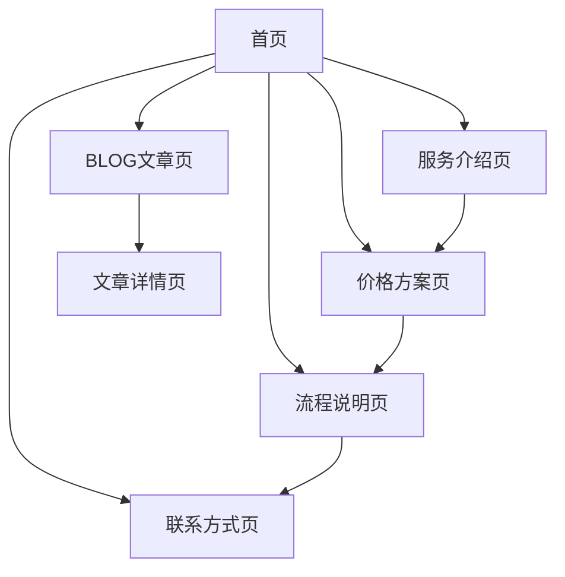

# 海外医疗辅助生殖网站产品需求文档

## 1. 产品概述

本项目旨在开发一个专业的海外医疗辅助生殖服务网站，为有生育需求的客户提供全面的海外医疗服务信息和咨询平台。网站将以专业、可信赖的形象展示服务内容，帮助用户了解海外辅助生殖医疗服务的完整流程和相关信息。

目标市场：面向有海外辅助生殖医疗需求的中文用户群体，提供专业的医疗服务信息展示和初步咨询服务。

## 2. 核心功能

### 2.1 用户角色

| 角色 | 访问方式 | 核心权限 |
|------|----------|----------|
| 访客用户 | 直接访问网站 | 浏览所有页面内容、查看服务信息、联系咨询 |
| 潜在客户 | 通过联系表单 | 提交咨询需求、获取个性化服务方案 |

### 2.2 功能模块

网站需求包含以下主要页面：
1. **首页**：品牌展示、核心服务概览、成功案例展示、快速导航
2. **服务介绍页**：详细的医疗服务项目介绍、专业团队展示、合作医院信息
3. **价格方案页**：透明的服务套餐定价、费用明细、支付方式说明
4. **流程说明页**：完整的服务流程图、时间安排、注意事项
5. **联系方式页**：多渠道联系方式、在线咨询表单、办公地址信息
6. **BLOG文章页**：医疗知识科普、行业资讯、成功案例分享

### 2.3 页面详情

| 页面名称 | 模块名称 | 功能描述 |
|----------|----------|----------|
| 首页 | 英雄区域 | 展示核心价值主张、专业形象图片、快速咨询入口 |
| 首页 | 服务概览 | 核心服务项目卡片展示、服务优势说明 |
| 首页 | 成功案例 | 客户成功故事展示、数据统计、客户评价 |
| 首页 | 快速导航 | 主要页面快速入口、联系方式展示 |
| 服务介绍页 | 服务项目 | 详细的辅助生殖服务介绍、技术说明、适用人群 |
| 服务介绍页 | 专业团队 | 医疗团队介绍、资质展示、专业背景 |
| 服务介绍页 | 合作医院 | 海外合作医院信息、医院资质、设备介绍 |
| 价格方案页 | 套餐展示 | 不同服务套餐对比、价格透明展示、包含服务明细 |
| 价格方案页 | 费用说明 | 详细费用构成、支付方式、退款政策 |
| 流程说明页 | 服务流程 | 完整服务流程图、每个阶段详细说明、时间安排 |
| 流程说明页 | 准备事项 | 客户需要准备的材料、注意事项、常见问题 |
| 联系方式页 | 联系信息 | 多种联系方式、办公地址、营业时间 |
| 联系方式页 | 咨询表单 | 在线咨询表单、快速预约、信息收集 |
| BLOG文章页 | 文章列表 | 医疗知识文章、行业资讯、分类筛选 |
| BLOG文章页 | 文章详情 | 文章内容展示、相关推荐、分享功能 |

## 3. 核心流程

**用户访问流程：**
用户通过搜索或推荐进入网站首页 → 浏览服务介绍了解详细信息 → 查看价格方案和服务流程 → 通过联系页面提交咨询需求 → 获得专业回复和个性化方案

**内容浏览流程：**
首页概览 → 服务详情 → 价格了解 → 流程认知 → 联系咨询 → BLOG学习

## 4. 用户界面设计

### 4.1 设计风格

- **主色调**：医疗蓝 (#2563EB)、纯白 (#FFFFFF)
- **辅助色**：浅灰 (#F8FAFC)、深灰 (#1E293B)、成功绿 (#10B981)
- **按钮风格**：圆角矩形、渐变效果、悬停动画
- **字体**：中文使用思源黑体，英文使用 Inter 字体，标题 24-32px，正文 16-18px
- **布局风格**：卡片式设计、顶部导航、响应式网格布局
- **图标风格**：线性图标、医疗相关图标、简洁现代风格

### 4.2 页面设计概览

| 页面名称 | 模块名称 | UI元素 |
|----------|----------|--------|
| 首页 | 英雄区域 | 全屏背景图、居中标题文字、渐变蒙版、CTA按钮 |
| 首页 | 服务概览 | 3列网格布局、服务图标、卡片阴影效果 |
| 服务介绍页 | 服务项目 | 左右交替布局、图文结合、渐进式展示 |
| 价格方案页 | 套餐展示 | 3列对比表格、推荐标签、价格突出显示 |
| 流程说明页 | 服务流程 | 时间轴设计、步骤图标、连接线动画 |
| 联系方式页 | 咨询表单 | 简洁表单设计、输入验证、提交反馈 |
| BLOG文章页 | 文章列表 | 卡片网格布局、缩略图、标签分类 |

### 4.3 响应式设计

网站采用移动优先的响应式设计策略，完美适配桌面端（1200px+）、平板端（768px-1199px）和移动端（<768px）。包含触摸优化的交互设计，确保在各种设备上都有良好的用户体验。