# 海外医疗辅助生殖网站技术架构文档

## 1. 架构设计


## 2. 技术描述

* **前端**: React\@18 + TypeScript + Tailwind CSS\@4 + Vite + React Router

* **国际化**: react-i18next

* **数据存储**: Supabase (PostgreSQL)

* **部署**: Vercel / Dokploy

* **样式**: Tailwind CSS 4 + 自定义医疗主题

## 3. 路由定义

| 路由        | 用途                 |
| --------- | ------------------ |
| /         | 首页，展示核心服务和品牌形象     |
| /services | 服务介绍页，详细展示医疗服务项目   |
| /pricing  | 价格方案页，透明展示服务套餐和费用  |
| /process  | 流程说明页，完整服务流程和准备事项  |
| /contact  | 联系方式页，多渠道联系和咨询表单   |
| /blog     | BLOG文章列表页，医疗知识和资讯  |
| /blog/:id | BLOG文章详情页，具体文章内容展示 |

## 4. API定义

### 4.1 核心API

联系表单提交

```
POST /api/contact
```

请求参数:

| 参数名称     | 参数类型   | 是否必需  | 描述           |
| -------- | ------ | ----- | ------------ |
| name     | string | true  | 联系人姓名        |
| email    | string | true  | 联系邮箱         |
| phone    | string | false | 联系电话         |
| message  | string | true  | 咨询内容         |
| language | string | true  | 语言偏好 (zh/en) |

响应:

| 参数名称    | 参数类型    | 描述   |
| ------- | ------- | ---- |
| success | boolean | 提交状态 |
| message | string  | 响应消息 |

示例:

```json
{
  "name": "张三",
  "email": "zhangsan@example.com",
  "phone": "+86 138****8888",
  "message": "希望了解试管婴儿服务详情",
  "language": "zh"
}
```

BLOG文章获取

```
GET /api/blog
GET /api/blog/:id
```

## 5. 数据模型

### 5.1 数据模型定义

```mermaid
erDiagram
  CONTACT_FORM ||--o{ CONTACT_SUBMISSION : contains
  BLOG_POST ||--o{ BLOG_CATEGORY : belongs_to
  BLOG_POST ||--o{ BLOG_TAG : has

  CONTACT_SUBMISSION {
    uuid id PK
    string name
    string email
    string phone
    text message
    string language
    timestamp created_at
    string status
  }
  
  BLOG_POST {
    uuid id PK
    string title_zh
    string title_en
    text content_zh
    text content_en
    string slug
    string featured_image
    boolean published
    timestamp created_at
    timestamp updated_at
  }
  
  BLOG_CATEGORY {
    uuid id PK
    string name_zh
    string name_en
    string slug
  }
  
  BLOG_TAG {
    uuid id PK
    string name_zh
    string name_en
    string slug
  }
```



### 5.2 数据定义语言

联系表单提交表 (contact\_submissions)

```sql
-- 创建表
CREATE TABLE contact_submissions (
    id UUID PRIMARY KEY DEFAULT gen_random_uuid(),
    name VARCHAR(100) NOT NULL,
    email VARCHAR(255) NOT NULL,
    phone VARCHAR(50),
    message TEXT NOT NULL,
    language VARCHAR(10) DEFAULT 'zh' CHECK (language IN ('zh', 'en')),
    status VARCHAR(20) DEFAULT 'pending' CHECK (status IN ('pending', 'processed', 'replied')),
    created_at TIMESTAMP WITH TIME ZONE DEFAULT NOW()
);

-- 创建索引
CREATE INDEX idx_contact_submissions_created_at ON contact_submissions(created_at DESC);
CREATE INDEX idx_contact_submissions_status ON contact_submissions(status);
CREATE INDEX idx_contact_submissions_language ON contact_submissions(language);

-- 权限设置
GRANT SELECT ON contact_submissions TO anon;
GRANT ALL PRIVILEGES ON contact_submissions TO authenticated;
```

BLOG文章表 (blog\_posts)

```sql
-- 创建表
CREATE TABLE blog_posts (
    id UUID PRIMARY KEY DEFAULT gen_random_uuid(),
    title_zh VARCHAR(200) NOT NULL,
    title_en VARCHAR(200) NOT NULL,
    content_zh TEXT NOT NULL,
    content_en TEXT NOT NULL,
    slug VARCHAR(200) UNIQUE NOT NULL,
    featured_image VARCHAR(500),
    excerpt_zh TEXT,
    excerpt_en TEXT,
    published BOOLEAN DEFAULT false,
    created_at TIMESTAMP WITH TIME ZONE DEFAULT NOW(),
    updated_at TIMESTAMP WITH TIME ZONE DEFAULT NOW()
);

-- 创建索引
CREATE INDEX idx_blog_posts_published ON blog_posts(published);
CREATE INDEX idx_blog_posts_created_at ON blog_posts(created_at DESC);
CREATE INDEX idx_blog_posts_slug ON blog_posts(slug);

-- 权限设置
GRANT SELECT ON blog_posts TO anon;
GRANT ALL PRIVILEGES ON blog_posts TO authenticated;

-- 初始化数据
INSERT INTO blog_posts (title_zh, title_en, content_zh, content_en, slug, published, excerpt_zh, excerpt_en)
VALUES 
('海外试管婴儿成功率解析', 'IVF Success Rates Analysis Overseas', '详细分析海外试管婴儿的成功率因素...', 'Detailed analysis of IVF success rate factors overseas...', 'ivf-success-rates-analysis', true, '了解影响海外试管婴儿成功率的关键因素', 'Understanding key factors affecting overseas IVF success rates'),
('选择海外辅助生殖的优势', 'Advantages of Overseas Assisted Reproduction', '探讨选择海外辅助生殖服务的各项优势...', 'Exploring the advantages of choosing overseas assisted reproduction services...', 'overseas-reproduction-advantages', true, '海外辅助生殖在技术、服务等方面的优势分析', 'Analysis of overseas assisted reproduction advantages in technology and services');
```

BLOG分类表 (blog\_categories)

```sql
-- 创建表
CREATE TABLE blog_categories (
    id UUID PRIMARY KEY DEFAULT gen_random_uuid(),
    name_zh VARCHAR(100) NOT NULL,
    name_en VARCHAR(100) NOT NULL,
    slug VARCHAR(100) UNIQUE NOT NULL,
    created_at TIMESTAMP WITH TIME ZONE DEFAULT NOW()
);

-- 权限设置
GRANT SELECT ON blog_categories TO anon;
GRANT ALL PRIVILEGES ON blog_categories TO authenticated;

-- 初始化数据
INSERT INTO blog_categories (name_zh, name_en, slug)
VALUES 
('医疗知识', 'Medical Knowledge', 'medical-knowledge'),
('成功案例', 'Success Stories', 'success-stories'),
('行业资讯', 'Industry News', 'industry-news'),
('常见问题', 'FAQ', 'faq');
```

